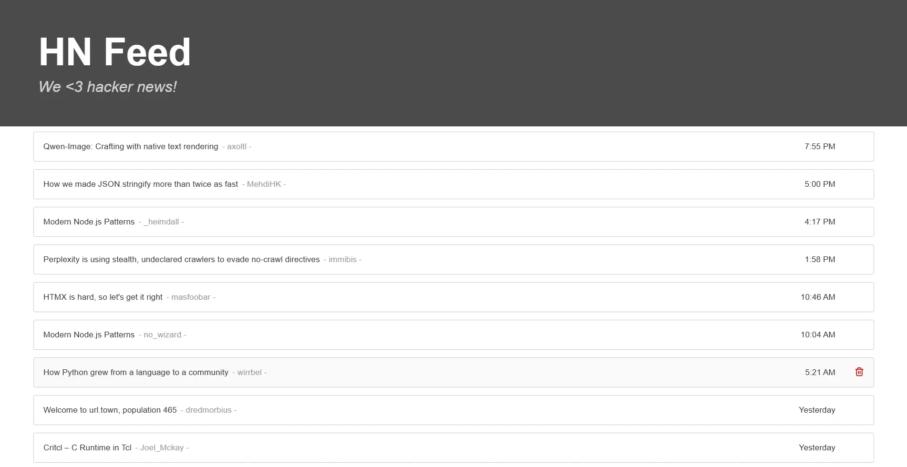

# Warm up Project Frontend

This is the frontend of the Warm up Project, a practice application developed for ApplyDigital. It is built using **Next.js** and **React**, and it communicates with a backend API to display a list of articles retrieved from the Hacker News Algolia API.

The interface includes features such as article listing, deletion of individual articles, and chronological sorting.

# Features

- **Banner**: Displays a title and subtitle introducing the Hacker News feed.
- **Chronological article list**: Shows a list of articles sorted by creation date.
- **Article details**: Each article displays its title, author, creation date, and a link to the original source.
- **Delete functionality**: Users can remove articles from the list using a delete button.

# Page

